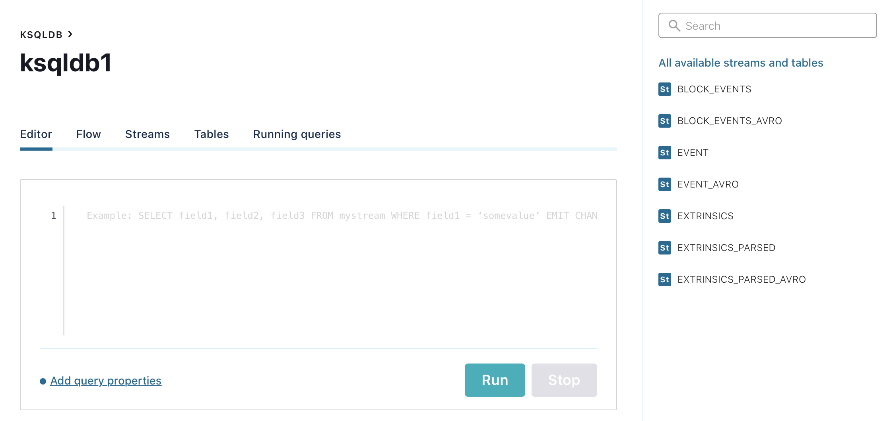

## Requirements
* Docker v1.11+
* Docker Compose
* Docker memory is allocated minimally at 8 GB

## How to start
```shell script
./start-docker.sh
```

## What does the script do?
The script will start all necessary KSQLDB, Kafka, ZooKeeper, PostgreSQL containers, create all demo streams and connectors for DB (It'll take about 5 minutes).

Also, it'll start:
* PolkadotStreamer - Node.js script, which collects block's info from Polkadot Node and send it to a Kafka topic - 'event';
* EventsEnrichment - python script, which receives block's hash from KSQLDB stream through REST API, gets block's events by the hash and send them to a Kafka topic - 'block_events'

## What is happening inside KSQLDB?
Data flow:


1. Data produced by PolkadotStreamer gets into Kafka Topic 'event' and further into KSQLDB stream 'EVENT';
    1. A stream called 'EVENT_AVRO' collects raw data from 'EVENT' with AVRO format and sends it to topic 'EVENT_AVRO' to sink it to a Postgres table 'block_raw';
    2. 'EXTRINSICS' - extracts block's number from raw data and explodes event.extrinsics field for further processing;
    3. 'EXTRINSICS_PARSED' - extracts all fields (signature, nonce, etc) from earlier exploded field;
    4. 'EXTRINSICS_PARSED_AVRO' - format data to AVRO, sends it to a topic 'EXTRINSICS_PARSED_AVRO' to sink it to a Postgres table 'extrinsics_parsed';
2. Data produced by EventsEnrichment gets into Kafka topic 'BLOCK_EVENTS' and further into KSQLDB stream 'BLOCK_EVENTS':
    1. 'BLOCK_EVENTS_AVRO' formats the data to AVRO and sends it to a topic 'BLOCK_EVENTS_AVRO' to sink it to a Postgres table 'block_events';

## How does data sink to a DB?

KSQLDB has a special JDBCSinkConnector.

It collects data from some Kafka topic and inserts the data to a DB table.

## How to see PoC?

Navigate to the Control Center web interface at http://localhost:9021/ and select your cluster.


* 'Topics' tab contains all topics created by the script and streams. Click by a topic and you see a full statistic about it.


* 'Connect' tab contains an info about all connectors in the system.


* 'ksqlDB' tab provides an interface for working with queries, streams and tables
